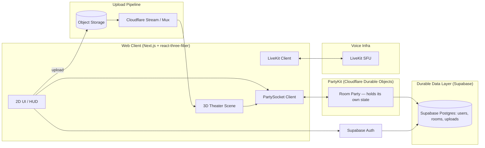
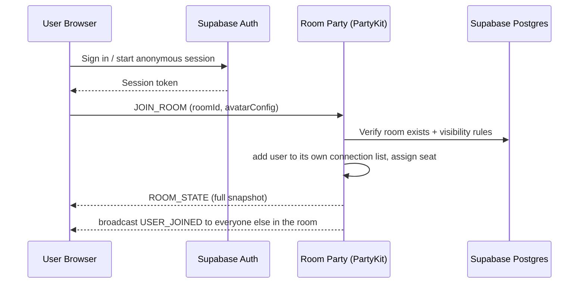
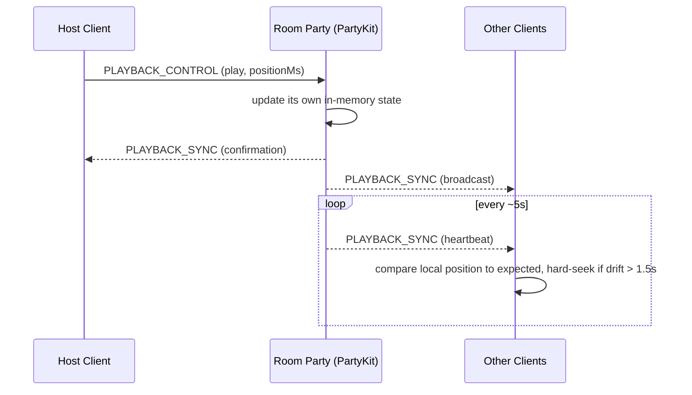
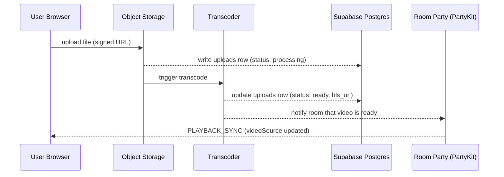

# Watchly — System Design

Companion to `watchly-technical-plan.md` (roadmap / protocol tables / schema). This doc covers how the pieces fit together, how data moves, and what breaks under load.

---

## 1. Goals & Constraints

- Real-time playback sync across all clients in a room (target drift tolerance: ~1.5s)
- Voice + text chat that scales past a handful of users per room
- Two independent video ingestion paths (external link vs. uploaded file) feeding the same playback pipeline
- Solo/small-team operable: prefer managed services over self-hosted infra everywhere that's viable at MVP scale

---

## 2. High-Level Architecture

**No more Redis:** each room is one PartyKit party — a Cloudflare Durable Object that already holds its own state in memory (with optional hibernation when idle) between messages. That's exactly the job Redis was doing before, so it comes out of the stack rather than getting swapped for something else. Supabase Postgres holds anything that needs to survive a restart — accounts, room configs, upload records.

---

## 3. Component Responsibilities

| Component | Responsibility |
|---|---|
| **Web Client** | Renders the 3D theater, HUD, chat; holds no authoritative state — it's a view over what the party and LiveKit report |
| **PartyKit (party per room)** | Single source of truth for room membership, seat assignments, and playback state; validates host-only actions server-side (never trust the client's claim of being host); holds this state directly, no separate cache layer needed |
| **Supabase Postgres** | Durable records: users, room configs, upload metadata, optionally chat history |
| **LiveKit (SFU)** | Voice audio routing; decoupled from the realtime party on purpose — voice traffic is a different scaling problem than chat/state sync |
| **Upload Pipeline** | Accepts uploaded files, transcodes to adaptive HLS, hands back a playable URL |
| **Supabase Auth** | Identity; also issues anonymous sessions for casual invitees who don't want to make an account |

---

## 4. Data Flow Walkthroughs

### Room join

### Playback sync

### Upload & transcode

---

## 5. Scaling

- **Realtime layer:** each room is its own PartyKit party (Durable Object), so rooms scale horizontally by definition — there's no shared server instance to overload, and no pub/sub layer needed to coordinate state across instances, since a given room's state only ever lives in that one party
- **Voice:** mesh WebRTC only works for very small rooms; LiveKit's SFU model is what actually lets a room grow past ~6–8 people without every client's upload bandwidth becoming the ceiling
- **Video delivery:** HLS + CDN means the transcoding step happens once per upload, not once per viewer
- **3D scene:** performance budget belongs to the client, not the server — keep avatar/room polycounts and texture sizes in check so rooms stay smooth on mid-range hardware, since there's no server-side fix for a client-side frame-rate problem

## 6. Failure Modes & Resilience

- **Host disconnects:** the party's own `onClose` handler fires when the host's connection drops, picks (or lets the room vote for) a new host, broadcasts `HOST_CHANGED` — playback state itself doesn't need to change, only who's allowed to control it
- **Client reconnects mid-session:** on reconnect, client re-sends `JOIN_ROOM` and gets a fresh `ROOM_STATE` snapshot rather than trying to resume some partial state — simpler and harder to get wrong than incremental resync
- **Transcode failure:** `uploads.status = 'failed'` surfaces directly in the room UI rather than leaving viewers staring at a stuck loading spinner
- **Party goes idle/hibernates:** PartyKit can hibernate a party between messages to save cost; on the next message it wakes and its state is intact, so this isn't a failure mode to design around — just worth knowing it happens

## 7. Security & Moderation

- All host-only actions (`PLAYBACK_CONTROL`, `KICK_USER`, `HOST_TRANSFER`) are re-checked server-side against the party's own `hostId` — the client UI hiding a button is not access control
- Uploaded content raises DMCA/takedown exposure — recommend gating uploads to private rooms only at MVP, plus a simple takedown request flow before opening uploads to public rooms
- Room passwords hashed, never compared in plaintext; rate-limit join attempts on password-protected rooms

## 8. Deployment Topology

| Piece | Where |
|---|---|
| Next.js web client | Vercel |
| Realtime (rooms/sync/chat) | PartyKit, deployed to Cloudflare (Durable Objects) |
| Postgres | Supabase |
| Auth | Supabase Auth |
| Voice SFU | LiveKit Cloud (or self-hosted later if cost/scale demands it) |
| Video storage + transcode | Cloudflare R2 + Cloudflare Stream (or Mux) |
| DNS/CDN | Cloudflare |

Notably absent: Railway/Fly.io and Redis — both were only there to host and back a custom Node WebSocket server, which PartyKit replaces outright.
