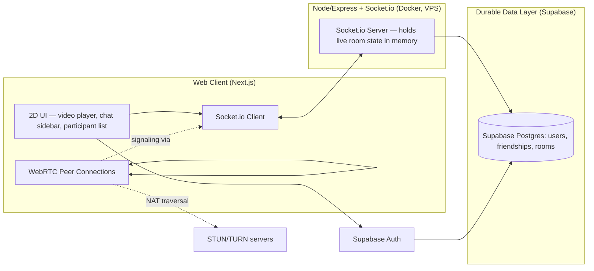
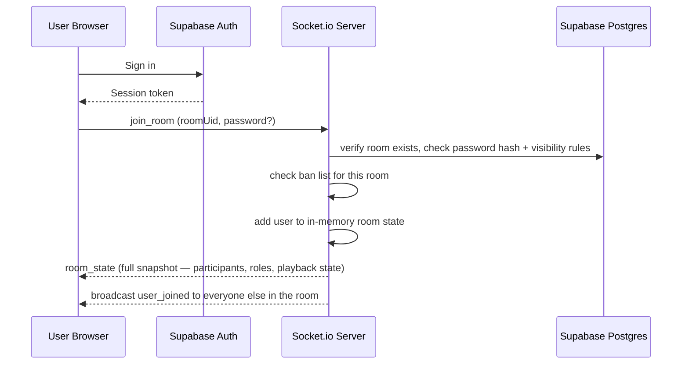
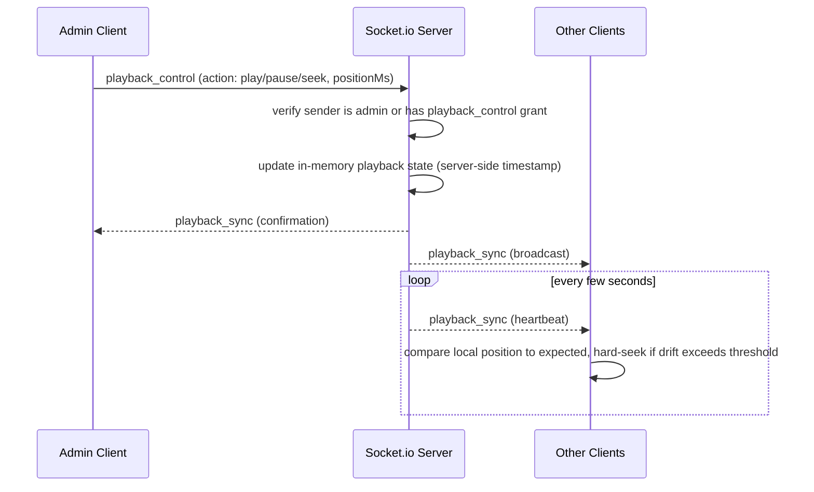
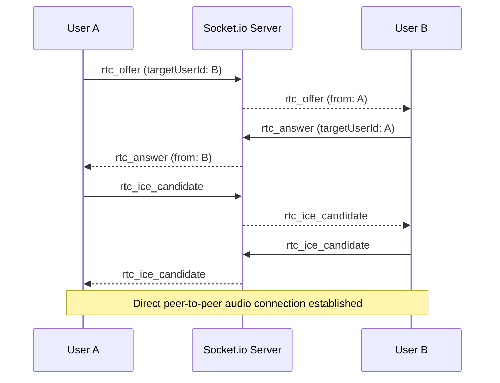

# Watchly — System Design

Companion to `watchly-technical-plan.md` (roadmap / protocol tables / schema). This doc covers how the pieces fit together, how data moves, and what breaks under load.

---

## 1. Goals & Constraints

- Real-time playback sync across all clients in a room (target drift tolerance: ~1–1.5s)
- Text + voice chat for small rooms (2–8 participants) in v1
- Single video ingestion path for v1: external link only (no upload pipeline)
- Backend is deliberately self-hosted (VPS + Docker) rather than a managed realtime
  platform — this is a solo-dev project used partly for DevOps/Docker practice, so
  "operable without a team" means "operable by one person who owns the ops," not
  "avoid ops entirely"

---

## 2. High-Level Architecture

**No managed realtime platform:** the Node/Express + Socket.io process is a single backend
service the developer owns end-to-end — deployed as a Docker container on a VPS
(DigitalOcean/Hetzner or similar). It holds all live room state (participants, playback
position, admin/role assignments, playback-control grants) in memory for the lifetime of
the process. Supabase Postgres holds only what needs to survive a restart: accounts, room
configs, friendships.

---

## 3. Component Responsibilities

| Component | Responsibility |
|---|---|
| **Web Client** | Renders the 2D Twitch-style layout (video player, chat sidebar, participant list, voice indicators); holds no authoritative state — it's a view over what the Socket.io server and WebRTC peers report |
| **Socket.io Server** | Single source of truth for room membership, roles (admin/moderator/viewer), playback state, and playback-control grants; validates admin-only actions server-side (never trusts the client's claim of being admin); also relays WebRTC signaling (offer/answer/ICE candidates) between peers in a room |
| **Supabase Postgres** | Durable records: users, friendships, room configs (uid, name, video URL, password hash, visibility, status) |
| **Supabase Auth** | Identity — email/password sign-up/login for v1; OAuth providers deferred |
| **WebRTC (peer-to-peer)** | Voice audio between participants directly; no media server in v1, appropriate for small rooms (2–8 people) |
| **STUN/TURN** | NAT traversal for WebRTC connections; STUN alone covers most cases, TURN is a fallback for restrictive networks/firewalls |

---

## 4. Data Flow Walkthroughs

### Room join

### Playback sync

### Voice chat setup (WebRTC signaling)

---

## 5. Scaling

- **Realtime layer:** v1 runs a single Socket.io server process — fine for the target
  scale (small rooms, modest concurrent room count). If room/user volume grows well
  beyond v1 expectations, options include running multiple Socket.io instances behind a
  sticky-session load balancer with a shared adapter (e.g. Redis pub/sub) — not needed at
  launch, noted here only so it's not a surprise later.
- **Voice:** mesh WebRTC only works for small rooms — each participant connects directly
  to every other participant, so bandwidth/CPU cost per client grows with room size.
  This is why v1 caps rooms small (2–8) and defers an SFU (LiveKit/mediasoup) to v3 for
  larger rooms.
- **Database:** Supabase Postgres only holds durable, low-frequency-write data (accounts,
  room configs, friendships) — it's not in the hot path for playback sync or chat, so it
  isn't a scaling bottleneck for v1's real-time features.

## 6. Failure Modes & Resilience

- **Admin disconnects without transferring the role:** the server's own disconnect
  handler fires, auto-promotes a fallback admin (e.g. the longest-present participant) or
  closes the room after a timeout — playback state itself doesn't need to change, only
  who's allowed to control it.
- **Client reconnects mid-session:** on reconnect, the client re-joins and receives a
  fresh `room_state` snapshot rather than trying to resume partial state — simpler and
  harder to get wrong than incremental resync.
- **Socket.io server restarts:** all in-memory room state (participants, playback
  position, roles) is lost. Acceptable trade-off for v1 given chat is ephemeral anyway;
  documented here as a known limitation rather than something to design around
  immediately — revisit if uptime issues arise in practice.
- **WebRTC connection fails behind a restrictive NAT/firewall:** falls back to TURN;
  if TURN also fails, that participant simply has no voice (text chat still works) rather
  than blocking them from the room.

## 7. Security & Moderation

- All admin-only actions (`playback_control`, `kick_user`, `mute_user`, `ban_user`,
  `transfer_admin`) are re-checked server-side against the Socket.io server's own record
  of the room's admin — the client UI hiding a button is not access control.
- Bans are enforced server-side on both the join-by-UID and join-by-invite paths; a
  banned user's ID is checked before a socket connection to that room is accepted.
- Room passwords are hashed before storage and validated server-side on join — never
  compared in plaintext, never validated client-side.
- Rate limiting applies to room creation and join attempts, to prevent UID brute-forcing
  on private rooms.
- Row Level Security (RLS) on Supabase Postgres ensures users can only read/write
  friendship and room rows they're authorized to touch.

## 8. Deployment Topology

| Piece | Where |
|---|---|
| Next.js web client | Vercel |
| Realtime (rooms/sync/chat/signaling) | Node/Express + Socket.io, Dockerized, on a VPS (DigitalOcean/Hetzner or similar) |
| Postgres | Supabase |
| Auth | Supabase Auth |
| Voice | WebRTC peer-to-peer (STUN, with TURN fallback) |

Notably absent: any managed realtime platform (PartyKit, etc.), any SFU media server
(LiveKit, mediasoup), and any video transcoding pipeline (Cloudflare Stream, Mux) — all
deferred to v3 alongside file uploads and large-room support.
